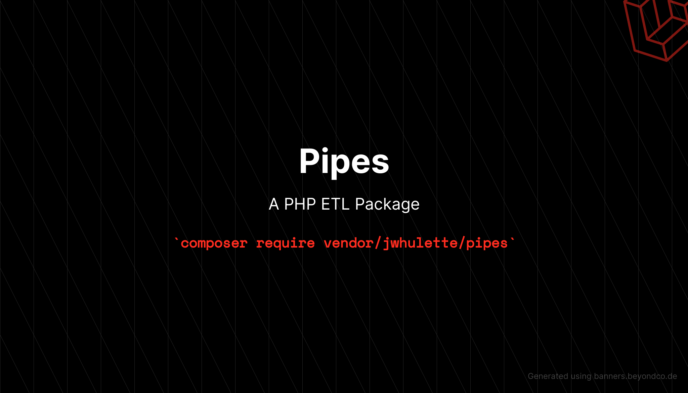

[](https://php.net/) 

[](https://github.com/jwhulette/pipes/actions?query=workflow%3Arun-tests+branch%3Amain) 
[](https://packagist.org/packages/jwhulette/pipes)

# Pipes

Pipes is a PHP Extract Transform Load [ETL] package for Laravel 8+

View documentation at https://jwhulette.github.io/pipes/

## Installation

```bash
composer require jwhulette/pipes
```

## Usage

1. Create a new EtlPipe object.

1. Add an extractor to the object to read the input file

Add an extractor to the object to read a file or database.

    - You can add as many transformers as you want.

    - Data is passed to the transfomers in the order they are defined

### Notes
**Built-in extractors:**
* CsvExtractor
* XlsxExtractor
* SqlExtractor

**Built-in loaders:**
* CsvLoader
* SqlLoader

**Built-in transformers:**
*CaseTransformer - Change the case of a string
*DateTimeTransformer - Change the format of a date string
*PhoneTransformer - Transform a US phone, removing all non numeric characters, and limiting the length to the first 10 digits
*TrimTransformer - Trim a string
*ZipcodeTransformer - Transform a US zip code, removing all non numeric characters, and left pad zeros for zip codes less than 5 digits
*ConditionalTransformer - Transform a column, based on the values of another column

*Data is passed to the transformers in the order they are defined*

```php
(new EtlPipe())
->extract(new CsvExtractor($this->csvFile));
->transforms([
    new CaseTransformer([], 'lower'),
    new TrimTransformer(),
])
->load(new CsvLoader('saved-file.csv'));
```

## Changelog

Please see [CHANGELOG](CHANGELOG.md) for more information on what has changed recently.

## Contributing

Please see [CONTRIBUTING](.github/CONTRIBUTING.md) for details.

## Security Vulnerabilities

Please review [our security policy](../../security/policy) on how to report security vulnerabilities.

## Credits

- [Wes Hulette](https://github.com/jwhulette)
- [All Contributors](../../contributors)

## License

The MIT License (MIT). Please see [License File](LICENSE.md) for more information.